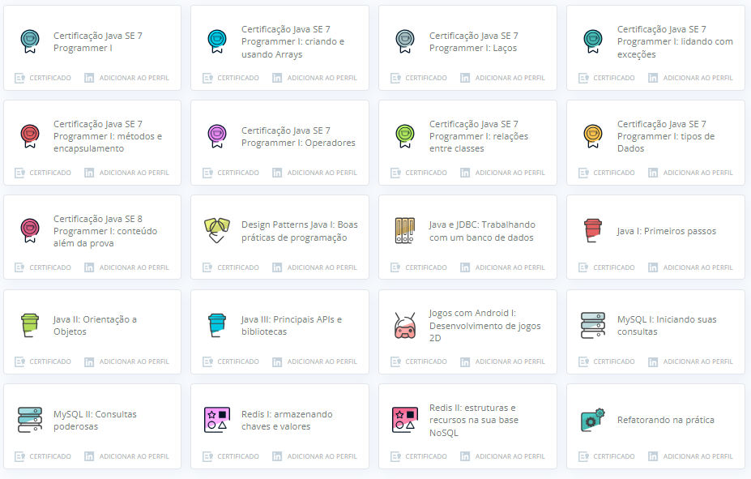
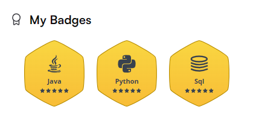

 

<!---
KleberVales/KleberVales is a ✨ special ✨ repository because its `README.md` (this file) appears on your GitHub profile.
You can click the Preview link to take a look at your changes.
--->

 

  
  
  
  

## 👨‍💻 About Me

 

👋 Hi, I'm Kleber Santos dos Vales, a software engineer passionate about building robust backend systems with Java and Spring Boot, applying modern DevOps practices to streamline automation, scalability, and reliability. I leverage tools like Git/GitHub, Docker, and Kubernetes to enable efficient CI/CD pipelines and cloud-native deployments. My work extends into Cloud Computing, designing architectures that balance performance and resilience, while also exploring the potential of Generative AI to enhance developer productivity and create intelligent solutions. With a strong foundation in Software Engineering, I strive to deliver systems that are not only technically sound but also aligned with business goals and user needs.

🏆 **Oracle Certified Associate – Java SE 7 Programmer**  
🏆 **Microsoft Technology Associate – Software Development Fundamentals**  
🏆 **Scrum Fundamentals Certified (SFC™)**  
🏆 **Oracle Cloud Infrastructure 2025 – DevOps Professional**  
🏆 **Oracle Cloud Infrastructure 2025 – Generative AI Professional**

🎓 **Bachelor's Degree in Computer Science**  
🎓 **MBA in Web Software Development**

 

---

 

## 🛠️ Portfolio Highlights

 

| 
     🏙️ **BOOKSTORE MANAGER**     Enterprise Book Inventory & Search System 
 
 A robust Java-based bookstore application designed to manage book inventory and provide fast, intuitive title searches. Built with a solid object-oriented architecture and relational database support.   • 📚 Complete book inventory management (CRUD) • 🔎 Fast search by title and keywords • 🗄️ Persistent data storage with MySQL & Hibernate • 🧱 Object-Oriented design with clean domain modeling  • 🖥️ Desktop interface built with Java Swing  • 🌐 Web technologies integration (HTML, CSS, JavaScript) • 🔐 Reliable relational database structure     
     
 | 
     🏗️ **WAREHOUSE CLIMATE MANAGER**     Enterprise Temperature & Humidity Control System 
 
 A robust Java-based warehouse monitoring application designed to track temperature and humidity in real time and automatically control ventilation systems, tailored for logistics environments such as the Port of Santos.    • 🌡️ Real-time temperature and humidity monitoring (CRUD) • 🌀 Automatic activation of ventilation systems based on sensor • 📊 Historical data logging for climate analysis and auditing • 🗄️ Persistent data storage with PostgreSQL & Hibernate (JPA)  • 🧱 Object-Oriented design with clean and modular domain  • 🖥️ Desktop interface built with JavaFX for operators  • ⚙️ Configurable climate thresholds (min/max)     
     
 |
|:--- |:--- |

| 
     🛒 **E-Commerce Platform**     Scalable E-Commerce Platform with Java & Spring 
 
 A robust and scalable e-commerce backend application built with Java & Spring Boot, designed to handle core online shopping operations with clean architecture, performance, and maintainability in mind.   • 🧾 Complete shopping cart and order management  • 📦 Product and inventory control  • 👤 User and customer domain handling • 🔄 Transactional operations with Spring Data JPA  • 🗄️ Persistent data storage using PostgreSQL  • 🧱 Clean architecture with layered design  • ⚙️ RESTful APIs following best practices    
     
 | 
   💰 **FINANCIAL CONTROL SYSTEM**     Enterprise Personal Finance Management Application 
 
 A robust Java-based financial control application designed to manage personal or small business finances, enabling precise tracking of income and expenses, detailed reporting, and efficient data navigation through pagination and sorting    • 💸 Expense and income registration (CRUD)   • 📅 Financial reports with period-based filters  • 📊 Paginated and sortable listings for expenses and revenues  • 🗄️ Persistent data storage using PostgreSQL & Hibernate (JPA)  • 🧱 Object-Oriented design with clean and modular domain   • 🔐 Business rules and validations applied at the service layer   • ⚙️ Configurable financial categories and report parameters      
      
 |
|:--- |:--- |

---
 

## 🏗️ Software Engineering Stack

 

### 🔄 DevOps & CI/CD

  
### 💻 Languages  
    

### 🧩 Frameworks 
  <!-- JavaFX -->  <!-- JUnit -->  <!-- Mockito -->  <!-- React --> 

### 🛢️ Databases  
    

### 📡 Messaging and Communication
  

### 🔧 Tools  
     

### 🎨 Design Patterns
    

### 📋 Project Management
 

 

---

 

## 📚 Courses and Improvements

 

---

 

## 🏆 HackerRank Profile Trophy

 
  
  

 

---

 

## 📈 GitHub Contribution Graph

 

---

 

---

 

 
