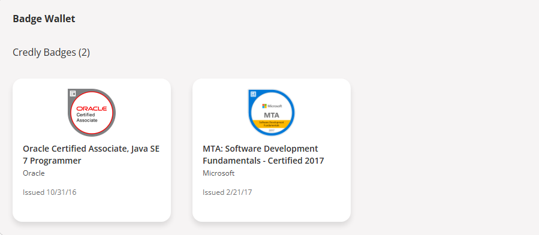

<!---
KleberVales/KleberVales is a ✨ special ✨ repository because its `README.md` (this file) appears on your GitHub profile.
You can click the Preview link to take a look at your changes.
--->

 

<!-- Typing animation -->

## 👨‍💻 About Me

Hello! I'm Kleber Vales, a Java Developer Analyst focused on back-end and systems architecture.  
I have experience with Java, Spring Boot, MySQL, and microservices.  
I'm always striving to evolve with best practices, DevOps, and cloud technologies.  

Welcome to my profile! 🚀

---

## 📊 GitHub Stats

Follow my journey on GitHub: commits, projects, most used languages, and key moments in my professional development!

Click to expand GitHub Stats 📈

<table align="center" width="100%" height="100%">
  <tr>
    <td></td>   
  </tr>
</table>

<table align="center" width="100%" height="100%">
  <tr>
    <td></td>
    <td></td>
    <td></td>
    <td></td>
  </tr>
</table>

---

### 💻 Programming Languages  
  

### 🛢️ Databases  
    

### ☁️ Cloud Technologies  
   

### 🔧 Tools  
   

---

## 📈 GitHub Contribution Graph

---

## 🏆 HackerRank Profile Trophy

 
  
  

---

---

## ✅ Licenses and Certificates

  
👉 See all my certifications on [Credly](https://www.credly.com/users/kleber-vales)

---

## 🚀 GitHub Trophies

---

